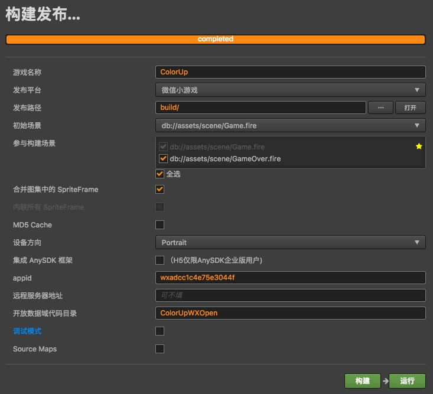

# ColorUp
Cocos Creator 微信小游戏《七彩蹦蹦》 主域项目

## build-templates 目录

`build-templates` 目录用来定制项目的构建流程[(Cocos Creator 相关文档)](https://docs.cocos.com/creator/manual/zh/publish/custom-project-build-template.html)。

`build-templates` 目录下的内容会在构建时被自动复制到构建结果中。如 `build-templates/wechatgame` 中的内容会复制到构建微信小游戏生成的 `/wechatgame/` 目录中。

* `wechatgame/cloudfunction` ：云函数。
* `wechatgame/project.config.json` ：项目配置（云函数目录），自动替换主域生成的 project.config.json 。

## 构建发布

**注意：**
* 游戏名称（ColorUp）并非构建后的游戏目录名，构建后的游戏目录名为 “wechatgame”。
* 发布平台指定为“微信小游戏”。
* 发布路径为默认路径（./build/），构建成功后，在 ./build/ 目录下会得到一个 wechatgame 目录（即生成的微信小游戏项目）。
* appid 已经指定了默认值（我申请的 appid），你也可以修改为自己的 appid 。
* 开放数据域代码目录（ColorUpWXOpen），与子域生成的目录对应。
