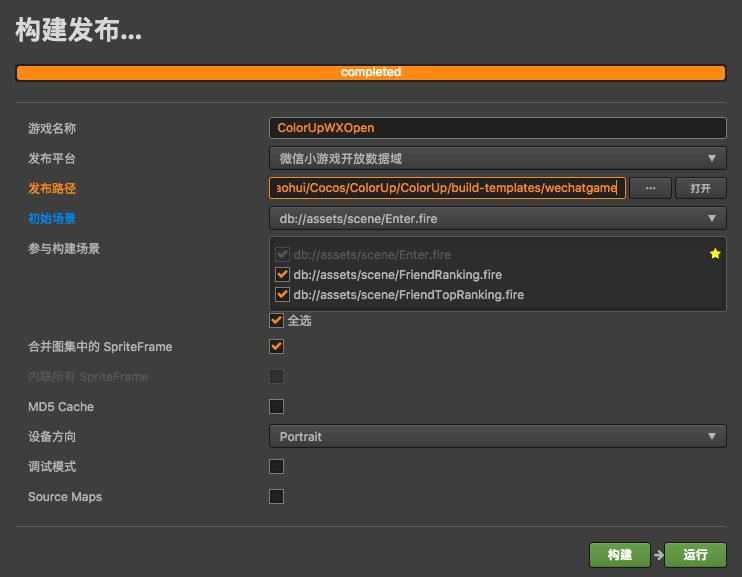

# ColorUp
Cocos Creator 微信小游戏《七彩蹦蹦》子域项目（排行榜）

## 构建发布

**注意：**
* 游戏名称（ColorUpWXOpen）即主域中的开放数据域代码目录名称。
* 发布平台指定为”微信小游戏开放数据域“。
* 发布路径指定为主域目录 `./ColorUp/ColorUp/build-templates/wechatgame`，该目录中的内容会在主域构建发布时自动复制到主域的构建结果中。
